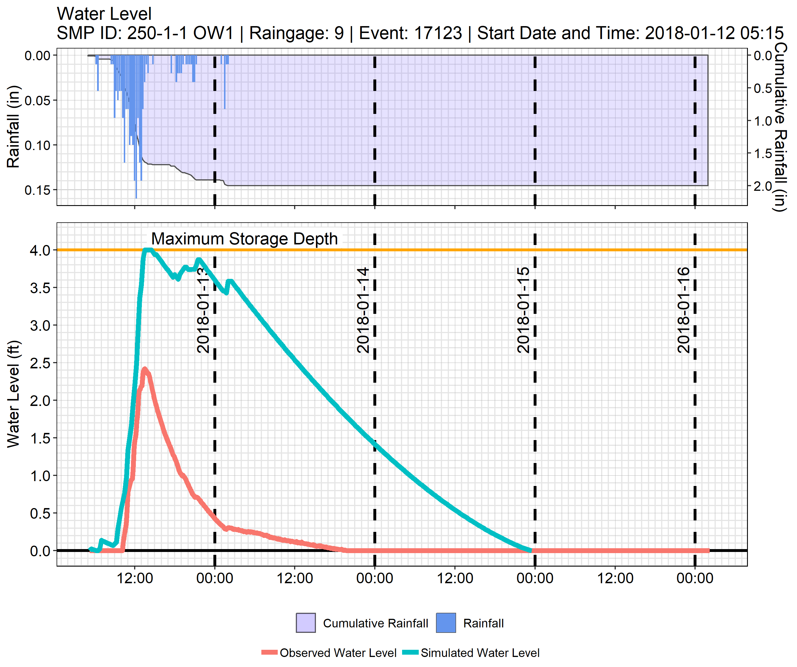
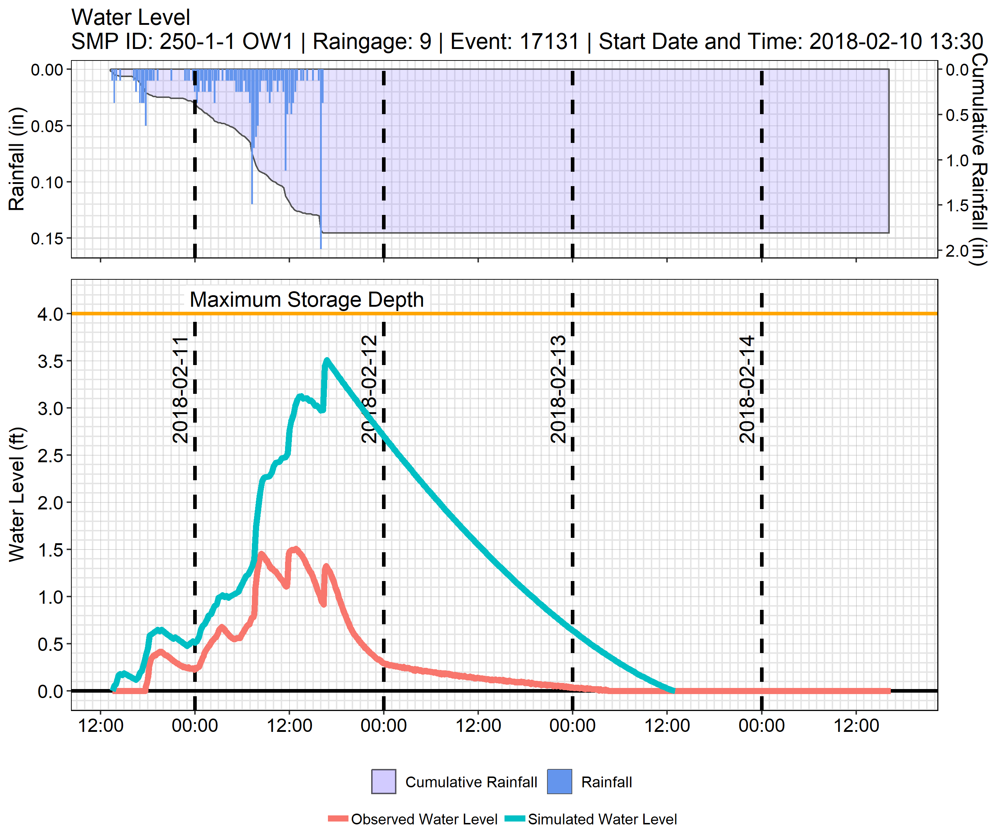

```{r setup, include = FALSE}
knitr::opts_chunk$set(
  echo = FALSE,
  collapse = TRUE,
  comment = "#>"
)
options(stringsAsFactors = FALSE, scipen = 999, knitr.table.format = 'html' )

library(pwdgsi)

directory <- "A:/Scripts/Misc/plots/"

```

### Introduction

This vignette uses the functions `marsFetchMonitoringData()` to retrieve SMP data for a specified date range and `marsFetchSnapshot()` to retrieve as-built metrics. Several SMP performance metrics are calculated for each rain event in the timeframe. Those performance metrics include percent of storage used (PSU) and relative percent of storage used (RPSU); infiltration rate and recession rate; draindown time; an overtopping check; and peak release rate. Water level and rainfall plots are generated for the top 3 events based on relative percent of storage used.

### Declaring Variables

Request criteria is defined below; this includes the start and end date of analysis, the SMP ID and OW Suffix (ie, OW1). In this vignette, rain events at a subsurface, unlined tree trench installed at Belmont School, SMP ID 250-1-1, will be analyzed. 
```{r declare, include=TRUE, echo = TRUE, eval = FALSE}
#declare variables
start_date <- "2018-01-01"
end_date <- "2018-03-01"
target_id <- "250-1-1"
ow_suffix <- "OW1"

#connection 
mars <- odbc::dbConnect(odbc::odbc(), "mars_testing")

```

### Fetch Data

First, the as-built SMP metrics are fetched from a live connection to the GreenIT database with `marsFetchSnapshot()`. These metrics are stored in a 'snapshot' in the MARS analysis database, and can be re-fetched in the future, even if the metrics change in GreenIT.

```{r snapshot, message=FALSE, include = TRUE, echo = TRUE, eval=FALSE}
#call snapshot
snapshot <- marsFetchSMPSnapshot(con = mars, 
                                 smp_id = target_id, 
                                 ow_suffix = ow_suffix, 
                                 request_date = "11/1/2019")
```

```{r load snapshot, include = FALSE}
snapshot <- snapshot_250
#also add variables that wasn't evaluated before (in order to not evaluate the database connection)
start_date <- "2018-01-01"
end_date <- "2018-03-01"
target_id <- "250-1-1"
ow_suffix <- "OW1"
```
SMP `r snapshot$smp_id` has a DCIA of `r snapshot$dcia_ft2` sf, with a storage footprint of `r snapshot$storage_footprint_ft2` sf. The storage depth is `r snapshot$storage_depth_ft` ft and the storage volume is `r snapshot$storage_volume_ft3` cf. The SMP has a sump depth of `r snapshot$sumpdepth_ft` ft, and the infiltration rate at the time of construction was `r snapshot$infil_dsg_rate_inhr` in/hr.
  
  
This analysis will use water level data, rainfall data, and rain event metrics to compute our SMP performance metrics. We will fetch all three data sets with a single call to `marsFetchMonitoringData()`. `marsFetchMonitoringData()` contains three separate functions, `marsFetchRainEventData()`, `marsFetchRainGageData()`, and `marsFetchLevelData()`. Each returns a dataframe, which are returned within a list.


```{r monitoring, message=FALSE, include = TRUE, echo = TRUE, eval = FALSE}
#fetch monitoring data
monitoringdata <- marsFetchMonitoringData(con = mars, 
                                          target_id = target_id, 
                                          ow_suffix = ow_suffix, 
                                          start_date = start_date, 
                                          end_date = end_date)
```

The list returned from `marsFetchMonitoringData()` contains one data frame for each type of requested data. Rain gage data and water level data contains additional rain event UIDs, to illustrate which rain event they belong to. These UIDs will tell us which rainfall data and/or rain event metrics to use for a given water level period.

```{r load monitoring data, message = FALSE, include = FALSE, echo = FALSE}
monitoringdata <- monitoringdata_250
```


```{r string, message=FALSE, include = TRUE, echo = TRUE}
str(monitoringdata, vec.len = 3)
```

### Calculate Performance Metrics

Performance metrics are calculated for observed data. First, rainfall data and water level data are joined together. Then, a time series of orifice outflow volumes are calculated using `marsUnderdrainOutflow_cf`. Then, the data is grouped by rainfall_gage_event_uid, and each performance metric is calculated in `dplyr::summarize()`. PSU and RPSU are calculated with `marsPeakStorage_percent()`. Saturated infiltration rate and saturated recession rate are calculated with `marsSaturatedPerformance_inhr()`. Draindown time is is figured with `marsDraindown_hr()`, and overflow is checked with `marsOvertopping_bool()`. `marsPeakReleaseRate_cfs()` computes the peak release rate. 

```{r Calculations, message = FALSE, include = TRUE, echo = TRUE}
#join monitoring data in one table
obs_data <- dplyr::left_join(monitoringdata[["Level Data"]], monitoringdata[["Rain Gage Data"]], 
                             by = c("dtime_est", "rainfall_gage_event_uid", "gage_uid"))  %>%
  dplyr::arrange(dtime_est) %>%
  dplyr::mutate(orifice_outflow_ft3 = marsUnderdrainOutflow_cf(dtime_est = dtime_est,
                                       waterlevel_ft = level_ft,
                                       orifice_height_ft = snapshot$assumption_orificeheight_ft,
                                       orifice_diam_in = snapshot$orifice_diam_in))

#create a summary table of observed data
observed_summary <- obs_data %>% 
  dplyr::filter(is.na(rainfall_gage_event_uid) == FALSE) %>% #remove rows without event ID
  dplyr::group_by(rainfall_gage_event_uid) %>%
  dplyr::summarize(
    
    #Observed storage utilization
    percentstorageused_peak = marsPeakStorage_percent(waterlevel_ft = level_ft, 
                                                      storage_depth_ft = snapshot$storage_depth_ft),
    
    #Observed relative storage utilization
    percentstorageused_relative = marsPeakStorage_percent(waterlevel_ft = level_ft - 
                                                                            dplyr::first(level_ft), 
                                                          storage_depth_ft = snapshot$storage_depth_ft),
    
    #Infiltration 
    infiltration_rate_inhr = marsSaturatedPerformance_inhr(event = rainfall_gage_event_uid,
                                         dtime_est = dtime_est,
                                         rainfall_in = rainfall_in,
                                         dcia_ft2 = snapshot$dcia_ft2,
                                         orifice_height_ft = snapshot$assumption_orificeheight_ft, 
                                         orifice_diam_in = snapshot$orifice_diam_in,
                                         storage_depth_ft = snapshot$storage_depth_ft,
                                         storage_vol_ft3 = snapshot$storage_volume_ft3,
                                         waterlevel_ft = level_ft,
                                         type = "infiltration"),
    
    #Recession
    recession_rate_inhr = marsSaturatedPerformance_inhr(event = rainfall_gage_event_uid,
                                          dtime_est = dtime_est,
                                          rainfall_in = rainfall_in,
                                          dcia_ft2 = snapshot$dcia_ft2,
                                          orifice_height_ft = snapshot$assumption_orificeheight_ft, 
                                          orifice_diam_in = snapshot$orifice_diam_in,
                                          storage_depth_ft = snapshot$storage_depth_ft,
                                          storage_vol_ft3 = snapshot$storage_volume_ft3,
                                          waterlevel_ft = level_ft,
                                          type = "recession"),
    
    #Draindown time
    draindown_hr = marsDraindown_hr(dtime_est = dtime_est, 
                                    rainfall_in = rainfall_in,
                                    waterlevel_ft = level_ft),
    
    #Did it overtop?
    overtop = marsOvertoppingCheck_bool(waterlevel_ft = level_ft, 
                                        storage_depth_ft = snapshot$storage_depth_ft), 
    
    #Peak Release Rate
    peakReleaseRate_cfs = marsPeakReleaseRate_cfs(dtime_est = dtime_est, 
                                                  orifice_outflow_ft3 = orifice_outflow_ft3), 
    
    #Orifice outflow
    orifice_outflow_cf = round(sum(orifice_outflow_ft3),0)
  )
```

The remainder of this vignette will focus on the largest three rain event responses, as measured by highest RPSU. In this case, PSU and RPSU are the same, because there is no standing water in the SMP.

```{r table, echo=TRUE}
#Get events with highest percent storage
percent_storage_top <- observed_summary %>%
  dplyr::arrange(desc(percentstorageused_relative)) %>%
  dplyr::top_n(3, percentstorageused_relative)

#Get data for top events
top_events <- dplyr::filter(obs_data, 
                obs_data$rainfall_gage_event_uid %in% percent_storage_top$rainfall_gage_event_uid)
```

```{r kable, message = FALSE}
#Show table of top event summary
knitr::kable(percent_storage_top, 
      digits = 2, 
      col.names = c("Rainfall Gage Event UID", 
                    "PSU", 
                    "RPSU", 
                    "Infiltration\n Rate (in/hr)",
                    "Recession\n Rate (in/hr)", 
                    "Draindown (hr)",
                    "Overtopping\n Check",
                    "Peak Release\n Rate (cfs)",
                    "Slow Release\n Volume (cf)"),
      caption = "Table 1: Top 3 Events by Relative Percent of Storage Used") %>% 
  kableExtra::kable_styling(bootstrap_options = "striped", full_width = FALSE, position = "left")
```

In the following table, for event 17122, infiltration rate and recession rate are -900. A number like -900 - a clear outlier, and an impossible recession rate - indicates a failure to calculate the metric. In this case, -900 means that the event did not include observation data that approximately equaled 5 or 7 inches water depth, which is where rates are calculated. -910 indicates that the code only captured the rising limb of the event, and -920 means that rainfall occured during the recession period. More information can be found at `?marsSaturatedPerformance_inhr`.  Draindown time is `NA` because the water level did not reach 0, and peak release rate is `NA` because there was no outflow.  


```{r table_examples, echo = FALSE}
#Get events with unique error codes
errors <- observed_summary %>% 
  dplyr::filter(infiltration_rate_inhr < 0) %>% 
  dplyr::distinct(infiltration_rate_inhr, .keep_all = TRUE)

errors %>% 
  knitr::kable(digits = 2, 
      col.names = c("Rainfall Gage Event UID", 
                    "PSU", 
                    "RPSU", 
                    "Infiltration\n Rate (in/hr)",
                    "Recession\n Rate (in/hr)", 
                    "Draindown (hr)",
                    "Overtopping\n Check",
                    "Peak Release\n Rate (cfs)",
                    "Slow Release\n Volume (cf)"),
      caption = "Table 2: Failure Example") %>% 
  kableExtra::kable_styling(bootstrap_options = "striped", full_width = FALSE, position = "left")

```

### Plotting the Three Largest Responses

In order to illustrate the difference between the observed performance data and the performance expected by the as-built characteristics and design assumptions, we will calculate a simulated response for this SMP. `marsSimulatedLevelSeries_ft()` will return a data frame containing time and rainfall alongside simulated depth, volume, and orifice outflow.  

```{r simulate, echo = TRUE, message = FALSE}
#isolate rain data from top events
rain_data <- monitoringdata[["Rain Gage Data"]]%>% 
  dplyr::filter(rainfall_gage_event_uid %in% percent_storage_top$rainfall_gage_event_uid)

#simulate water level
simulated_data <- marsSimulatedLevelSeries_ft(dtime_est = rain_data$dtime_est,
                                rainfall_in = rain_data$rainfall_in,
                                event = rain_data$rainfall_gage_event_uid,
                                infil_footprint_ft2 = snapshot$infil_footprint_ft2,
                                dcia_ft2 = snapshot$dcia_ft2,
                                orifice_height_ft = snapshot$assumption_orificeheight_ft,
                                orifice_diam_in = snapshot$orifice_diam_in,
                                storage_depth_ft = snapshot$storage_depth_ft,
                                storage_vol_ft3 = snapshot$storage_volume_ft3,
                                infil_rate_inhr = snapshot$infil_dsg_rate_inhr)
```

```{r simulated_table}
simulated_data %>% head(3) %>% knitr::kable(digits = 2, 
                                     col.names = c("Datetime (EST)", 
                                                   "Rainfall (in)", 
                                                   "Rainfall Gage \n Event UID", 
                                                   "Simulated Depth (ft)", 
                                                   "Simulated Volume (cf)", 
                                                   "Simulated Orifice\n Outflow (cf)"),
                                     caption = "Table 3: Simulated Water Level Data") %>% 
  kableExtra::kable_styling(bootstrap_options = "striped", full_width = FALSE, position = "left")

```

Finally, we will plot each rain event, with its observed and simulated response. `marsCombinedPlot()` will produce a ggplot object containing a hyetograph of the rain event, as well as a water level plot showing the response. Internal calls to `gridExtra` functions will line the plot axes and margins up with one another.

```{r create plots, warning=FALSE, include=TRUE, fig.keep='none', echo = TRUE, message=FALSE, eval=FALSE}
#loop through events and save a plot for each
for(i in 1:length(percent_storage_top$rainfall_gage_event_uid)){
  
  #filter for each event
  selected_event <- top_events %>%
    dplyr::filter(rainfall_gage_event_uid == percent_storage_top$rainfall_gage_event_uid[i])
  rain_data <- monitoringdata[["Rain Gage Data"]] %>%
    dplyr::filter(rainfall_gage_event_uid == percent_storage_top$rainfall_gage_event_uid[i])
  sim_event <- simulated_data %>%
    dplyr::filter(rainfall_gage_event_uid == percent_storage_top$rainfall_gage_event_uid[i])
  
  #plot observed and simulated data
  plot <- marsCombinedPlot(event = percent_storage_top$rainfall_gage_event_uid[i],
                         structure_name = paste(target_id, ow_suffix),
                         obs_datetime = selected_event$dtime_est,
                         obs_level_ft = selected_event$level_ft,
                         sim_datetime = sim_event$dtime_est,
                         sim_level_ft = sim_event$Simulated_depth_ft,
                         storage_depth_ft = snapshot$storage_depth_ft,
                         orifice_show = TRUE,
                         orifice_height_ft = snapshot$assumption_orificeheight_ft,
                         rainfall_datetime = rain_data$dtime_est,
                         rainfall_in = rain_data$rainfall_in,
                         raingage = rain_data$gage_uid)

  #save plots
  plot_file_name <- paste0(directory, "chart_obs_sim", i, ".png")
  ggplot2::ggsave(plot_file_name, plot = plot, width = 9.25, height = 7.75, units = "in")

}
```

{width=700px}

`r caption_text <- paste("Figure 1: Hyetograph and SMP", target_id, "Water Level Response with Highest Observed Relative Percent of Storage Used (RPSU)")`

`r kableExtra::text_spec(caption_text, color = "grey")`  

{width=700px}

`r caption_text <- paste("Figure 2: Hyetograph and SMP", target_id, "Water Level Response with Second Highest Observed RPSU")`

`r kableExtra::text_spec(caption_text, color = "grey")`  

{width=700px}

`r caption_text <- paste("Figure 3: Hyetograph and SMP", target_id, "Water Level Response with Third Highest Observed RPSU")`

`r kableExtra::text_spec(caption_text, color = "grey")`